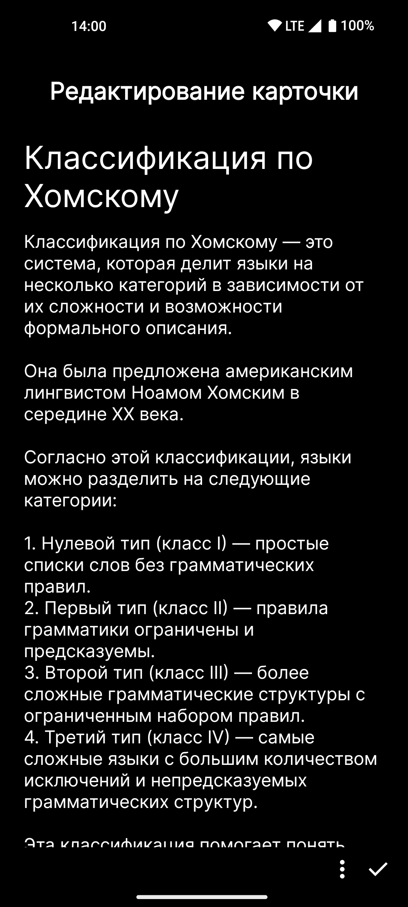
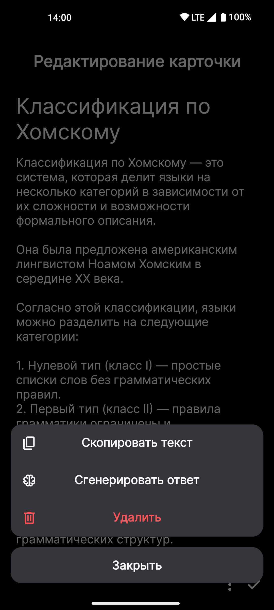
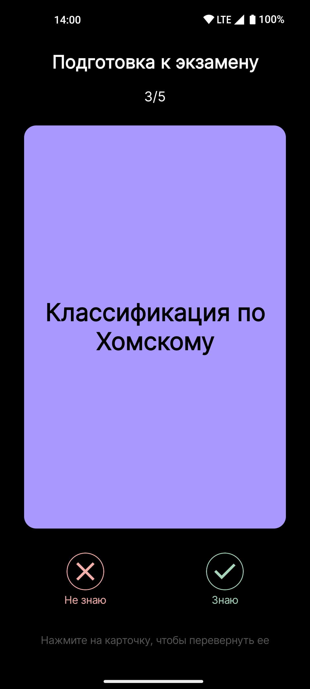

# FlashIt

## Описание
FlashIt - это Android-приложение для создания наборов флеш-карточек, предназначенное для эффективного запоминания информации. Оно позволяет пользователям создавать, редактировать, удалять карточки и наборы, а также использовать YandexGPT для атоматической генерации ответа на вопросы в карточках.

## Скриншоты

  
  
  
  
  
  

## Возможности
1. Создание, редактирование, удаление наборов карточек;
2. Создание, редактирование, удаление карточек в наборе;
3. Генерация ответа на вопрос карточки с использованием YandexGPT.

## Использованные технологии и библиотеки
- Koltin;
- Coroutines и Flow;
- Jetpack Compose и Jetpack Naviagtion;
- Локальная БД Room;
- Dagger Hilt;
- OkHttp, KotlinSerialization.

## Описание модулей
- **card_editor** - модуль для создания/удаления/редактирования карточек в наборе;
- **card_grid** - модуль для отображения карточек в наборе в виде сетки;
- **card_learn** - модуль для режима заучивания карточек;
- **card_set_management** - модуль для создания/удаления/редактирования наборов карточек;
- **core** - модуль, содержащий локальную БД, к которой обращаются другие модули;
- **network** - модуль с репозиторием для получения и обработки ответа, получаемого от YandexGPT.
