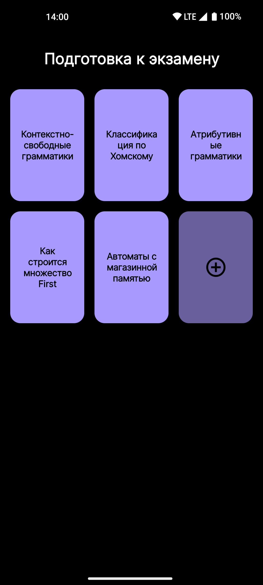

# FlashIt

## Описание
FlashIt - это Android-приложение для создания наборов флеш-карточек, предназначенное для эффективного запоминания информации. Оно позволяет пользователям создавать, редактировать, удалять карточки и наборы, а также использовать YandexGPT для атоматической генерации ответа на вопросы в карточках.

## Скриншоты

  
  
  
  
  
  

## Возможности
1. Создание, редактирование, удаление наборов карточек;
2. Создание, редактирование, удаление карточек в наборе;
3. Генерация ответа на вопрос карточки с использованием YandexGPT.

## Использованные технологии и библиотеки
- Koltin и Kotlin Coroutines;
- Jetpack Compose и Jetpack Naviagtion;
- Локальная БД Room;
- Dagger Hilt;
- Retrofit, OkHttp, KotlinSerialization.

## Цели для обучения
- Освоение и реализация MVVM/MVI архитектуры с принципами Clean Architechture;
- Использование многомодульной архитектуры для четкого разделения ответственности и масштабируемости проекта;
- Практика использования Kotlin для разработки под Android;
- Работа с Jetpack Compose для создания современного и отзывчивого UI;
- Использование Dagger Hilt для знакомства с внедрением зависимостей;
- Написание чистого, поддерживаемого и тестируемого кода.
